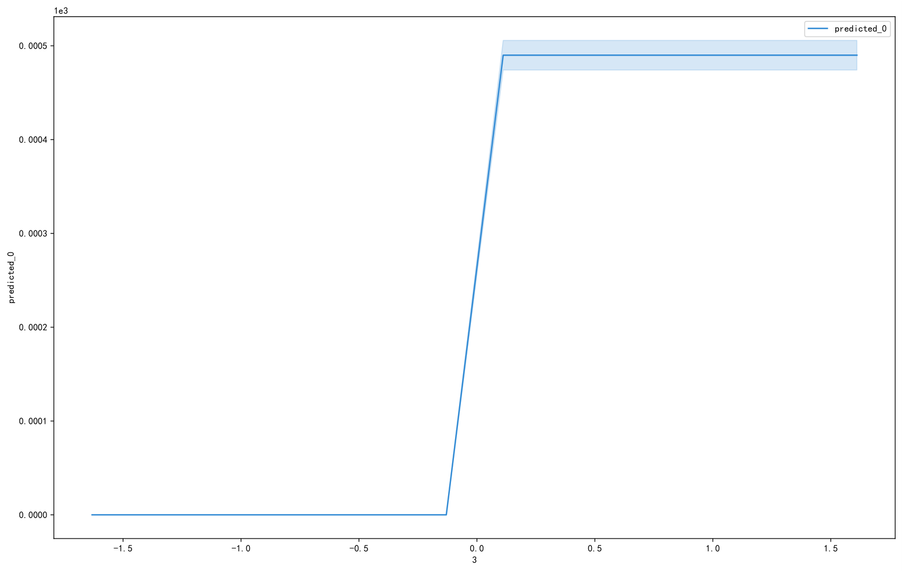
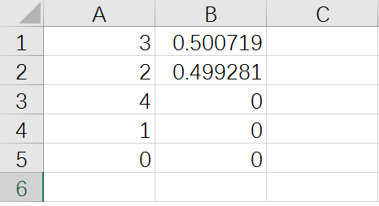
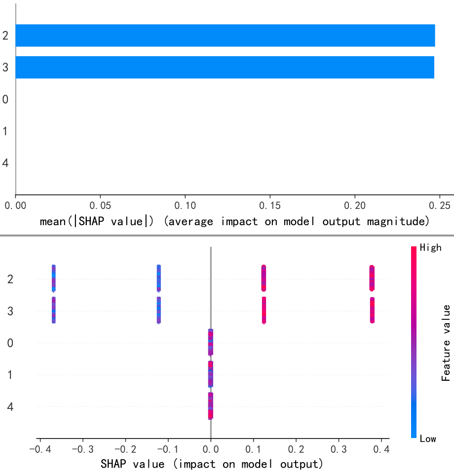
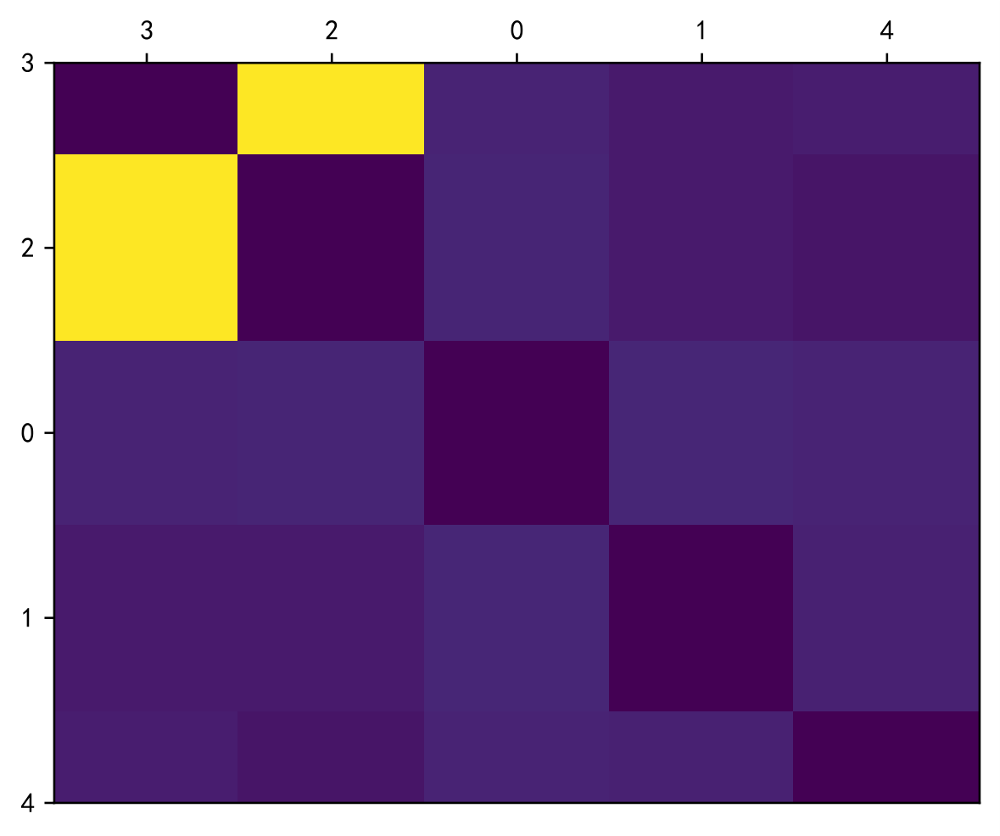
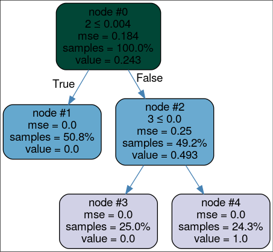
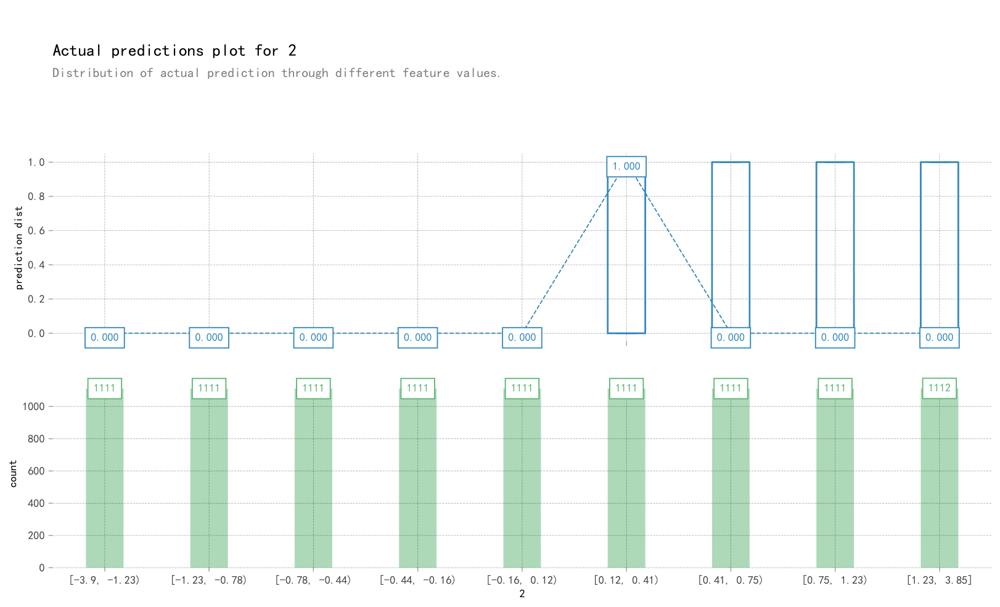
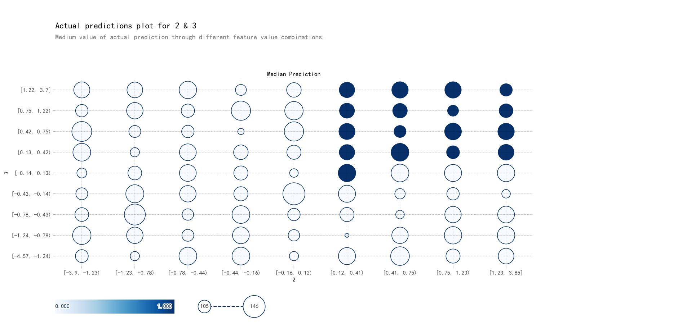
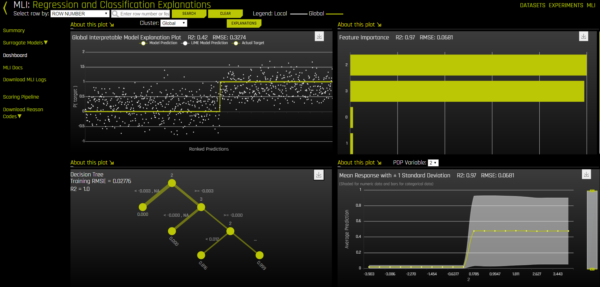
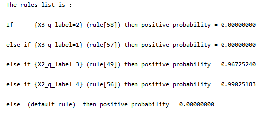

# Machine Learning Interpretation

## Installation

```julia
using Pkg
pkg"add MLInterpret"
```

Try without installation using docker

```bash
docker run -it --rm astupidbear/mli
```

Or build it from Dockerfile

```bash
url=https://raw.githubusercontent.com/AStupidBear/MLInterpret.jl/master/Dockerfile.py
python3 -c "$(curl $url)"
```

## Usage

```julia
using MLInterpret
X = DataFrame(randn(Float32, 10000, 5))
y = (X[3] > 0) & (X[2] >= 0)
@from lightgbm imports LGBMRegressor
model = LGBMRegressor()
model.fit(X, y)
```

You can interpret any machine learning model from Python which has a property `.predict` by calling

```julia
interpret(model, X, y)
```

If your model dosen't have a property '.predict' (like Julia models), you can still interpret its predictions by

```julia
ŷ = model.predict(X)
interpret(X, ŷ)
```

This will generate a folder `mli` in the current directory which contains

- `pdp.pdf`: partial dependency plot [link](https://oracle.github.io/Skater/reference/interpretation.html#partial-dependence) 
- `perturb_feaimpt.csv`: feature importance calculated by purturbation [link](https://oracle.github.io/Skater/reference/interpretation.html#feature-importance) 
- `shap.pdf`: shap value [link](https://github.com/slundberg/shap) 
- `shap2.pdf`: shap interaction value [link](https://github.com/slundberg/shap) 
- `surrogate_tree-*.pdf`: surrogate tree [link](https://oracle.github.io/Skater/reference/interpretation.html#skater.core.global_interpretation.tree_surrogate.TreeSurrogate) 

- `actual.pdf`: actual plot [link](https://pdpbox.readthedocs.io/en/latest/actual_plot.html) 
- `actual2.pdf`: actual interaction plot [link](https://pdpbox.readthedocs.io/en/latest/actual_plot_interact.html) 

### MLI with [H2O Driverless AI](https://www.h2o.ai/products/h2o-driverless-ai/)

#### Installation

```julia
MLI.install_dai()
MLI.start_dai()
```

You can get a trial license of H2O Driverless AI from [H2O](https://www.h2o.ai/try-driverless-ai/), then open `http://127.0.0.1:12345/`, login and enter your license.

#### Interpret

```julia
dai_interpret(X, y)
```

Open `http://127.0.0.1:12345/`, click `MLI`, choose the toppest `Interpreted Model`



### MLI with [Bayesian Rule List](https://oracle.github.io/Skater/reference/interpretation.html#skater.core.global_interpretation.interpretable_models.bigdatabrlc.BigDataBRLC)

#### Installation

```julia
using Pkg
ENV["MLI_RL"] = 1
Pkg.build("MLI")
```

### Interpret

```julia
sbrl_interpret(X, y)
```

A file named `sbrl.txt` will be created in your working directory.

